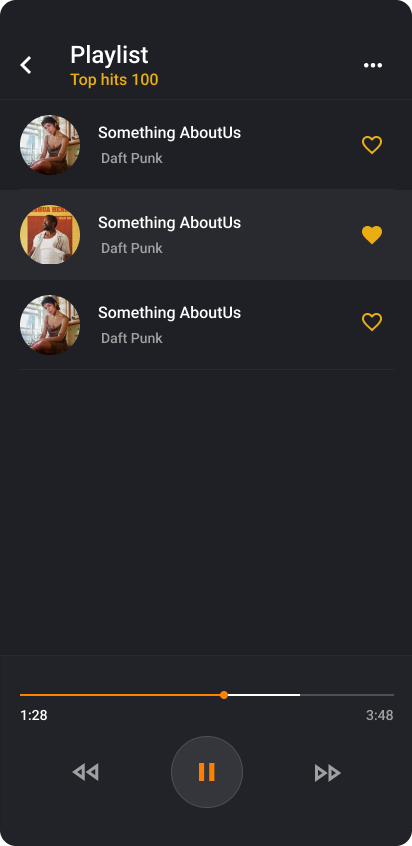

# Jango Player

This is still a work in progress.

To start the project on android:

- install the `jango-player-development-env.apk` from build folder on your emulator
- add globally `eas-cli`, `expo-cli`
- add `node_modules\` to the project
- start with `yarn start`
- when asked on your emulator how to open this project, select `Development Build`

To run the app on android:

- install the `jango-player-preview-build.apk` from build folder

## Playlist design:



## Expo - creating custom development client

---

You need eas and expo cli

```
npm install -g expo-cli
expo install react-native-track-player expo-dev-client
```

eas.json

```
{
  "build": {
    "development": {
      "developmentClient": true,
      "distribution": "internal",
      "android": {
        "buildType": "apk"
      }
      ...
    },
    ...
}
```

you need account on expo.dev, then build custom Expo Go app

```
eas build --profile=development --platform=android
```

then install the custom Expo Go app on emulator or phone...

## Support for Expo ^43 on react-native-track-player

---

Steps for install:

Install dependencies - EAS will take care of the manual linking

```
expo install react-native-track-player expo-dev-client
```

Add developmentClient: true to your development build in eas.json (and set android build type to APK for easier install):

# eas.json

```
 {
   "build": {
     "development": {
      "developmentClient": true,
       "distribution": "internal",
      "android": {
        "buildType": "apk"
      }
     }
 }
```

If deploying to iOS, add your development device

```
eas device:create
```

Submit your development build to EAS

```
eas build --profile=development --platform=all  # or 'ios' or 'android'
# (this will take 10-20 minutes, get a coffee)
```

The binary that EAS will compile for you is your custom Expo Go client.
Download to your device(s) platform-appropriately.
From now on, instead of running expo start, run

```
expo start --dev-client
```

You can now carry on as usual, and your ReactNativeTrackPlayer-referencing code should work

## Build apk

```
expo build:android
```

or

```
eas build -p android --profile preview
```
